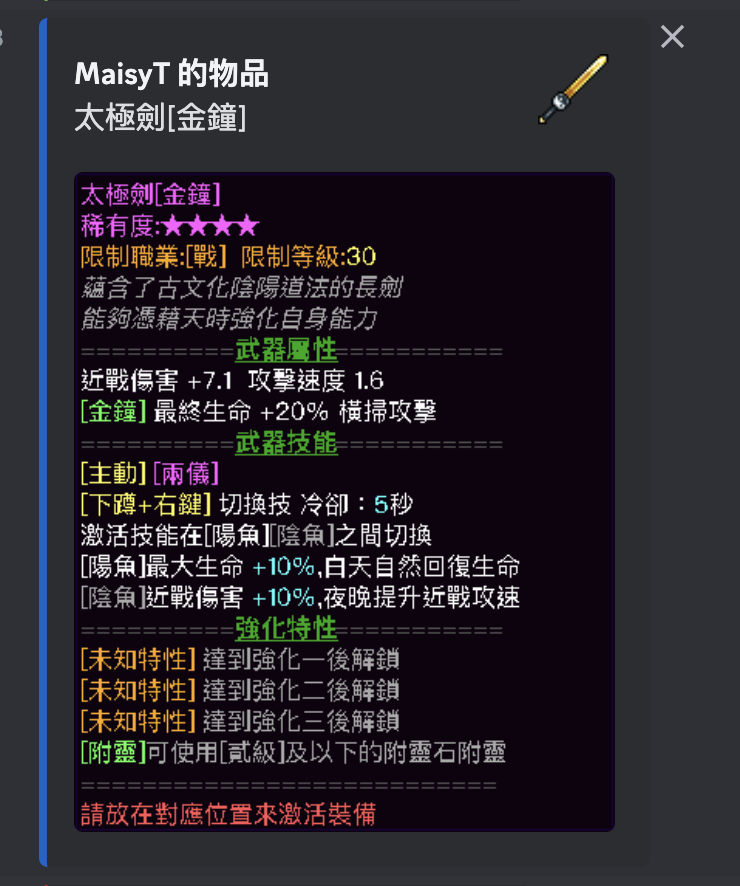

# Minecraft Mod for Showing Items Details to Discord
Idea from [DiscordSRV](https://www.spigotmc.org/resources/discordsrv.18494/). As my friend and I cannot find a replacement in Fabric server so I implement a simple one for us.

## Usage 
This is a server side Fabric mod for sending item details to a Discord text channel when player type `[i]` in the chat.

Item info show in the Discord message include: 
- name (translated if provide language pack)
- owner (player ID)
- count
- lore (translated if provide language pack)
- item image and item lore image (if in image mode)

Example:
An item from a RPG map [盤靈古域](http://pan-gu-continent.blogspot.com/) and its MC-version-upgraded version [夢回盤靈](https://search.mcbbs.net/forum.php?mod=viewthread&tid=1116615&extra=page%3D1&page=1).


## How to starts?
1. Put the mod to a Fabric server.
2. Start the server. A config temple should show up in the config directory. If it is missing, use the command to generate one.
3. Fill in the fields in the config file.
4. Reload the mod by command (or restart the server).
5. You should see the bot send a bot-online message to Discord.
6. Player hold the item they wants to share in the main hand and type `[i]` in the chat will trigger a message send to Discord.

## Admin Commands
### Generate a config template
`show_item_to_discord generate_config <override exiting config file if exists?>`
e.g. `show_item_to_discord generate_config true`
Generate a template config file to the server config file.

### Reload the mod
`show_item_to_discord reload`
Useful for reloading the mod after updating the config file.

### Shutdown the mod
`show_item_to_discord shutdown`
Shut down all resources of the mod, including disconnecting the Discord bot.

## Config
File path: (Sever side) `config/show-items-config.json`
> The config directory refer to the path given by `FabricLoader.getInstance().getConfigDir()`.

A full example at [here](./README/show-items-config.json).

```json
{
  "language": "zh_tw", # the language for the translation
  "languagePackPath": [ 
    # the relative path (root: server root path given by FabricLoader.getInstance().getGameDir()) to language packs 
    # the mod will search for a translation stating from the first pack and continue in the next one only if it is not found 
    # supported filetype: zip, json
    "resource/Pangu-Languagepack.zip",
    "resource/minecraft-lang-1.19.3.zip"
  ],
  "texturePackPath": [
    # the relative path to the texture packs 
    # In text mode: not needed
    # In image mode: optional
    # If no texture pack should be use, set it as a empty list []
    # supported filetype: zip
    "resource/Pangu-Resourcepack.zip"
  ],
  "fontPath": [
    # extra font to load if it not in the system 
    # supported filetype: ttc, ttf
    # If no extra font, set it as a empty list []
    "config/PingFang.ttc"
  ],
  "discord": {
    # the discord bot setting
    "serverToken": "xxxxxxxxxxxxxxxxxxx.xxxxxxxxxx-xxx-xxxxx",
    "channelId": "123213124194912649164"
  },
  "message": {
    # image mode or text mode
    "mode": "image",

	"image": {
        # setting if in image mode

        # font to used
        # the font name may not match the loaded ***.ttc filename
        # make sure it match one of the name in the "Available fonts" log
        "font": "PingFang HK",
        # the image width of the item description 
        "itemDescriptionImageWidth": 350
    },

    "startMessage": {
        # the message send to Discord when the mod is enable and the bot is started successfully
        "embedColor": "#61de2a",
        "message": ":green_circle: Show item bot is now online!"
    },
    "stopMessage": {
        # the message send to Discord when the mode is disable
        "embedColor": "#ff0000",
        "message": ":red_circle: Show item bot is now offline."
    },
    "showSingleItemMessage": {
        # the setting for the item message
        "embedColor": "#1260cc",
        "title": "${PlayerName} item",
        "includeTooltips": true # to include the tooltip/lore or not
    }
  }
}
```

## Support version
Fabric
- 1.19.3 (master)

## Debug log
If you face any problem, it is a good idea to turn on the debug log.

You can add a log4j setting to enable the debug log. See [log4j.xml example](./README/log4j2.xml). To use the setting, one way is to add the filepath to the server JVM parameter: `java ... -Dlog4j.configurationFile=log4j2.xml`.

## Restriction
- A server host in MacOS is not able to use the image mode as "java.awt" cannot run in parallel with Minecraft in the same process there.
- This mod can only get the texture and the translation for the vanilla items that appear in the provided resource pack.